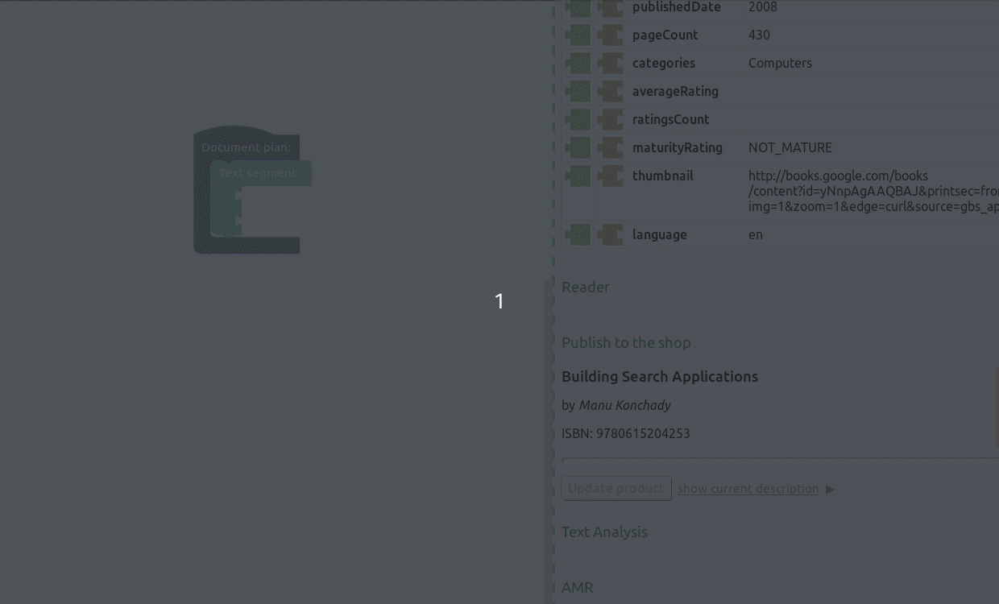

<div >

  <div valign="middle" height="125">
    
  </div>

  <a href="http://www.tokenmill.lt">
    
  </a>
 
</div>


----

*A picture is worth a thousand words.* Or is it? 
Tables, charts, pictures are all useful in undestanding our data but often we need a description – a story to tell us what are we looking at. 
**Accelerated Text** is a natural language generation tool which allows you to define data descriptions and then generates multiple versions of those descriptions varying in wording and structure.


<div align="center"><a name="menu"></a>
  <h3>
    <a href="#about">
      About
    </a>
    <span> • </span>
    <a href="#philosophy">
      Philosophy
    </a>
    <span> • </span>
    <a href="#getting-started">
      Getting Started
    </a>
    <span> • </span>
    <a href="#usage">
      Usage
    </a>
    <span> • </span>
    <a href="#development">
      Development
    </a>
    <span> • </span>
    <a href="#getting-help">
      Getting Help
    </a>
  </h4>
</div>


<br>

<div align="center">

</div>


## About

Accelerated Text can work with all sorts of data:

* descriptions of business metrics
* customer interaction data
* product attributes
* financial metrics

With Accelerated Text you can use such data to generate text for your business reports, your e-commerce platform or your customer support system.

Accelerated Text provides a web based **Document Plan** builder, where: 
* the logical structure of the document is defined
* communication goals are expressed
* data usage within text is defined

Document Plans and the connected data are used by Accelerated Text's Natural Language Generation engine 
to produce multiple variations of text exactly expressing what was intended to be communicated to the readers.

## Philosophy

> Whereof one cannot speak thereof one must be silent <br>
>   -- _Wittgenstein_

Natural language generation is a broad domain with applications in chat-bots, story generation, and data descriptions to name a few. 
Accelerated Text focuses on applying NLG technology to solve your *data to text* needs.

Data descriptions require precision. 
For example, generated text describing weather conditions should not contain things beyond those provided in the initial data – temperature: -1C, humidity: 40%, wind: 10km/h. 
Despite this, the expression of an individual fact – temperature – could vary. It could result in "it is cold", or "it is just below freezing", or "-1C", but this fact *will* be stated because it is present in the data. 
A data to text system is also not the one to elaborate on a story adding something about the serenity of some freezing lake – again, it was not in the supplied data.

Accelerated Text follows the principle of this strict adherence to the data-bound text generation. 
Via its user interface it provides instruments to define how the data should be translated into a descriptive text. 
This description – a document plan – is executed by natural language generation engine to produce texts that vary in structure and wording but are always and only about the data provided.

## Key Features

* **Document plan** editor to define what needs to be said about the data.
* **Data samples** can be uploaded as CSV files to be used when building Document Plans.
* **Text structure variations** to provide richer reading experience going beyond rigid template generated text.
* **Vocabulary control** to match the language style of each of your reader groups.
* **Build-in rule engine** to allow the control of what is said based on the different values of data points.
* **Live preview** to see variations of generated text.


## Getting Started

### Running

If you want to start tinkering and run it based on the latest code in the repository, first make sure that you have [make](https://www.gnu.org/software/make/) installed, then clone the project and run

```
make run-dev-env
```

After running this command the front-end will be availabe at the http://localhost:8080

The generation back-end API is at http://localhost:3001

For full information on Deployment, visit [Deployment Section](docs/deployment.md)

### Usage

#### Create Document Plan

Follow the step by step guide bellow to create a very simple document plan which generates book authorship sentences.

| View | Step |
| ------ | ------ |
|  | Press _Create a new document plan_ in the upper left corner of the screen. |
|  | Make sure that an empty document plan similar to the one pictured on the left has appeared in the workspace. |
|  | Select bundled sample _books.csv_ file in Data section on the right. |
|  | Select _Text Segment_ block by pressing left mouse button on it. |
|  | Open block search menu by pressing "CTRL + ,". |
|  | Type "author" and select pink _Abstract Meaning Representation_ block. |
|  | Press on newly appeared "author" block and open search menu again ("CTRL + ,"). |
|  | Select green "authors" data block which is our _Agent_ in this case. |
|  | Repeat the same process to select "title" data block which will represent _Co-Agent_. |
|  | The plan is ready by now and should look like the picture on the left. |
|  | Navigate to _Text Analysis_ section to see text variations generated by the natural language generation engine. |

#### GraphQL API

You should have running accelerated text environment and simple document plan created by now, if not, please refer to previous sections.
 
Here we will describe Accelerated Text GraphQL API usage in order to fetch generated texts. For this purpose we will need to pass two bits of information to the NLG backend: *document plan identifier* and *data item identifier*.

The GraphQL endpoint is accessible at `http://localhost:3001/_graphql`. CURL will be used to illustrate the calls to the back end.

First lets get registered document plans:

```
curl -X POST -H "Content-Type: application/json" \
  --data '{"query": "{documentPlans(offset:0 limit:10){totalCount items{id name dataSampleId dataSampleRow}}}" }' \
  http://localhost:3001/_graphql
```

This will return a list of document plans:

```json
{
  "data": {
    "documentPlans": {
      "totalCount": 1,
      "items": [
        {
          "id": "e39836ed-0283-4080-a436-554d9c48b839",
          "name": "Book store",
          "dataSampleId": "ba177b94-1963-4e21-979d-bf0cba75e05c",
          "dataSampleRow": 0
        }
      ]
    }
  }
}
```

The `id` field gives document plan id, and the `dataSampleId` field specifies which data to use. Using these fields we construct a text generation request.
With this, a second call has to be made to get the results identifier for actual sentence polling. Polling is used because text is not generated right away, NLG process for a more complcated plans can take some time.

```
curl -XPOST -H "Content-Type: application/json" \
  --data '{"documentPlanId":"e39836ed-0283-4080-a436-554d9c48b839","dataId":"ba177b94-1963-4e21-979d-bf0cba75e05c"}' \
  http://localhost:3001/nlg/ 
```

A result id is returned:

```json
{"resultId": "6f26099d-429d-41e9-9800-83ab58c59ddd"}
```

With this a final request can be made to fetch the results. Note that it can be done repeatedly with high performance, since the text generation is not happening at this stage.

```
curl -XGET -H "Content-Type: application/json" http://localhost:3001/nlg/6f26099d-429d-41e9-9800-83ab58c59ddd
```

You should get generated text with annotations (data is truncated):

```json
{
  "offset": 0,
  "totalCount": 2,
  "ready": true,
  "variants": [
    {
      "type": "ANNOTATED_TEXT",
      "id": "ae9a1d60-4aa6-49da-9738-480243a5095b",
      "children": [
        {
          "type": "PARAGRAPH",
          "id": "ab8b650a-8774-4992-8a56-fe8d01f74097",
          "children": [
            {
              "type": "SENTENCE",
              "id": "5cda3e9f-8fad-4b69-a0a3-f9f5e9a19465",
              "children": [
                {
                  "type": "WORD",
                  "id": "db5c71ec-f893-4406-8a3f-e91ca6aa08dc",
                  "text": "Building"
                },
                {
                  "type": "WORD",
                  "id": "84e164c7-1fd0-4f18-b120-8a4f7563741b",
                  "text": "Search"
                },
                {
                  "type": "WORD",
                  "id": "2e54b4b1-ed52-4689-8f5f-0a06ec8a35b5",
                  "text": "Applications"
                }
              ]
            }
          ]
        }
      ]
    }
  ]
}
```

#### Clojure API use

Accelerated Text UI helps with creating document plans and testing them with sample data. 
Accelerated Text's generation functionality can be used directly from the Clojure code.

Lets say you have a book data limited to the author and the book title:

| title                       | authors       |
| -----                       | ------        |
| Frankenstein                | M. W. Shelley |
| Dracula                     | Bram Stoker   |
| The Island of Doctor Moreau | H.G. Wells    |

When working via UI this data needs to be uploaded as the CSV. To use it in the code we'll have to represent it as a Clojure map. 

```clojure
(def data
  [{:title   "Frankenstein"
    :authors "M. W. Shelley"}
   {:title   "Dracula"
    :authors "Bram Stoker"}
   {:title   "The Island of Doctor Moreau"
    :authors "H.G. Wells"}])
```

Second component needed for generation is the plan itself. In UI it has a nice representation in visual blocks, and is persisted in the structure like this:

```clojure
(def document-plan
  {:type     "Document-plan"
   :segments [{:type     "Segment"
               :children [{:type           "AMR"
                           :conceptId      "author"
                           :dictionaryItem {:type   "Dictionary-item"
                                            :itemId "author"
                                            :name   "author"}
                           :roles          [{:name     "agent"
                                             :children [{:name "authors"
                                                         :type "Cell"}]}
                                            {:name     "co-agent"
                                             :children [{:name "title"
                                                         :type "Cell"}]}
                                            {:name "theme" :children [nil]}]}]}]})
```

State needs to be initialized

```clojure
(require '[mount.core :as mount])
(mount/start-without #'api.server/http-server #'data.datomic.impl/conn)
```

With all those those in place we can generate text:

```clojure
(map (partial api.nlg.generate/generate-row document-plan) data)
=>
(("Frankenstein is written by M. W. Shelley." "M. W. Shelley is the author of Frankenstein.")
 ("Bram Stoker is the author of Dracula." "Dracula is written by Bram Stoker.")
 ("H.G. Wells is the author of The Island of Doctor Moreau." "The Island of Doctor Moreau is written by H.G. Wells."))
```


## Development

To get started with a development environment for Accelerated Text please follow the instructions in our developer's guides 
for the [front-end](front-end/README.md) and the [text generation engine](core/README.md).

## Getting Help

If you have any questions, do not hesitate asking us at accelerated-text@tokenmill.ai

If you'll submit an *Issue* this will help everyone and you will be able to track the progress of us fixing it. 
In order to facilitate it please provide description of needed information for bug requests (like project version number, Docker version, etc.)


## License 

Copyright &copy; 2019 [TokenMill UAB](http://www.tokenmill.lt).

Distributed under the The Apache License, Version 2.0.
