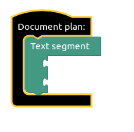

<div >

  <div valign="middle" height="125">
    
  </div>

  <a href="http://www.tokenmill.lt">
    
  </a>
 
</div>


----

*A picture is worth a thousand words.* Or is it? 
Tables, charts, pictures are all useful in undestanding our data but often we need a description; a story to tell us what are we looking at. 
**Accelerated Text** is a natural language generation tool which allows you to define data descriptions and then generates multiple versions of those descriptions varying in wording and structure.


<div align="center"><a name="menu"></a>
  <h3>
    <a href="#about">
      About
    </a>
    <span> • </span>
    <a href="#philosophy">
      Philosophy
    </a>
    <span> • </span>
    <a href="#getting-started">
      Getting Started
    </a>
    <span> • </span>
    <a href="#usage">
      Usage
    </a>
    <span> • </span>
    <a href="#development">
      Development
    </a>
    <span> • </span>
    <a href="#getting-help">
      Getting Help
    </a>
  </h4>
</div>


<br>

<div align="center">

</div>


## About

Accelerated Text can work with all sorts of data:

* descriptions of business metrics, 
* metadata describing interactions with the customers, 
* product attributes, 
* financial metrics.

Based on it will generate text to be used in business reports, e-commerce platforms or your customer support system.

Accelerated Text provides a web based **Document Plan** builder, where 
* the logical structure of the document is defined, 
* communication goals are expresed, 
* data usage within a text is defined.

Document Plans and the connected data are used by Accelerated Text's Natural Language Generation engine 
to produce multiple variations of the text exactly exactly expressing what was intended to bo communicated to the readers.

## Philosophy

> Whereof one cannot speak thereof one must be silent <br>
>   -- _Wittgenstein_

Natural language generation is a broad domain with applications in chat-bots, story generation, and data description to name a few. 
Accelerated Text focuses on applying NLG technology to solve your "data to text" needs.

Data descriptions require precision. 
For example, a text describing weather conditions can not invent things beyond what it was provided: Temperature: -1C, Humidity: 40%, Wind: 10km/h. 
A generated text can only state those facts. The expression of an individual fact - temperature - could vary. 
It could result in a "it is cold", or "it is just below freezing", or "-1C" but this fact will be stated because it is in the data. 
A "data to text" system is also not one to elaborate on a story about the serenity of the freezing lake - again, it was not in the supplied data.

Accelerated Text follows the principle of this strict adherence to the data-bound text generation. 
Via its user interface it provides instruments to define how the data should be translated into descriptive text. 
This description - a document plan - is executed by its natural language generation engine to produce texts that vary in structure and wording but are always and only about the data provided.

## Key Features

* **Document plan** editor to define what needs to be said about the data.
* **Data samples** can be uploaded as CSV files to be used when building Document Plans.
* **Text structure variations** to provide richer reading experience going beyond rigid template generated text.
* **Vocabulary control** to match the language style of each of your reader groups.
* **In build rule engine** to allow the control of what is said based on the different values of the data points.
* **Life preview** to see variations of generated text.


## Getting Started

### Running

#### Docker

To run *Accelerated Text* via Docker, just type

```
docker-compose -p dev -f docker-compose.yml pull && \
        docker-compose -p dev -f docker-compose.yml down && \
        docker-compose -p dev -f docker-compose.yml build && \
        docker-compose -p dev -f docker-compose.yml up --remove-orphans
```

After running this command the front-end will be availabe at the http://localhost:8080

The generation back-end API is at http://localhost:8081

#### From Source

If you want to start tinkering and run it based on the latest code in the repository, first make sure that you have the following dependencies installed:

* [make](https://www.gnu.org/software/make/)
* [npm](https://nodejs.org )

Then clone the project and run

```
make run-front-end-dev-deps
```

follwed by

```
make run-front-end-dev

```

After running this command the front-end will be availabe at the http://localhost:8080

The generation back-end API is at http://localhost:8081

### Usage

Follow the step by step guide bellow to create a very simple document plan which
generates book authorship sentences.


| View | Step |
| ------ | ------ |
|  | Firstly a new document plan has to be created. The application starts with a _Create Plan_ button in its workspace. |
|  | You get an initial empty plan. |
|  | You'll need to select a CSV file to provide data for the natural language generation. Select a _books.csv_ file. |
|  | The central part of the plan is the _Abstract Meaning Representation_ element which defines the message to be communicated. Select _Author_ from the AMR section. |
|  | Then we need to select from where in our book store data we'll have the _Author_ field. |
|  | Same for _Title_ field. |
|  | That's it, the plan is ready and should look like in the picture to the right. |
|  | _Text Analysis_ section shows text variations generated by the natural language generation engine. |


## Development

To get started with a development environment for Accelerated Text please follow the instructions in our developer's guides 
for the [front-end](front-end/README.md) and the [text generation engine](core/README.md).

## Getting Help

If you have any questions, do not hesitate asking us at accelerated-text@tokenmill.lt

If you'll submit an *Issue* this will help everyone and you will be able to track the progress of us fixing it. 
In order to facilitate it please provide description of needed information for bug requests (like project version number, Docker version, etc.)


## License 

Copyright &copy; 2019 [TokenMill UAB](http://www.tokenmill.lt).

Distributed under the The Apache License, Version 2.0.
