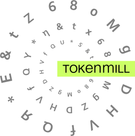

<div align="center"><a name="menu"></a>
  <h3>
    <a href="#usage">
      Usage
    </a>
    <span> • </span>
    <a href="#getting-help">
      Getting Help
    </a>
    <span> • </span>
    <a href="#developing">
      Developing
    </a>
    <span> • </span>
    <a href="#license">
      License
    </a>
    <span> • </span>
    <a href="https://twitter.com/tokenmill">
      Follow Us
    </a>
  </h4>
</div>


[](https://opensource.org/licenses/Apache-2.0)


*A picture is worth a thousand words.* Or is it? Tables, charts, pictures are all useful to undestand the data but often 
we need a description, a story to explain to us what are we looking at. 
**Accelerated Text** is a text generation tool which allows to define how the data is to be described 
and then produces multiple versions of those descriptions which vary in wording and text structure.


Accelerated Text can work with all sorts of data:

* descriptions of business metrics, 
* metadata describing interactions with the customers, 
* product attributes, 
* financial metrics.

Based on it will generate text to be used in business reports, e-commerce platforms or your customer support system.

Accelerated Text provides a web based **Document Plan** builder, where 
* the logical structure of the document is defined, 
* communication goals are expresed, 
* data usage within a text is defined.

Document Plans and the connected data are used by Accelerated Text's Natural Language Generation engine 
to produce multiple variations of the text exactly exactly expressing what was intended to bo communicated to the readers.

## Key Features

* **Document plan** editor to define what needs to be said about the data.
* **Data samples** can be uploaded as CSV files to be used when building Document Plans.
* **Text structure variations** to provide richer reading experience going beyond rigid template generated text.
* **Vocabulary control** to match the language style of each of your reader groups.
* **In build rule engine** to allow the control of what is said based on the different values of the data points.
* **Life preview** to see variations of generated text.


## Getting Started

### Running

#### Docker

To run *Accelerated Text* via Docker, just type

```
docker-compose -p dev -f docker-compose.yml pull && \
        docker-compose -p dev -f docker-compose.yml down && \
        docker-compose -p dev -f docker-compose.yml build && \
        docker-compose -p dev -f docker-compose.yml up --remove-orphans
```

After running this command the front-end will be availabe at the http://localhost:8080

The generation back-end API is at http://localhost:8081

#### From Source

If you want to start tinkering and run it based on the latest code in the repository, first make sure that you have the following dependencies installed:

* [make](https://www.gnu.org/software/make/)
* [npm](https://nodejs.org )

Then clone the project and run

```
make run-front-end-dev-deps
```

follwed by

```
make run-front-end-dev

```

After running this command the front-end will be availabe at the http://localhost:8080

The generation back-end API is at http://localhost:8081

### Usage

Follow the the step by step buide bellow to create a very simple document plan which
generates book authorshop sentence.

<table width="400px">

<tr>
<th>Step</th>
<th>View</th>
</tr>

<tr>
<td>Firstly a new document plan has to be created. Application starts with a _Create Plan_ button in its workspace.</td>
<td></td>
</tr>

<tr>
<td>You should get an initial emtpy plan.</td>
<td></td>
</tr>

<tr>
<td>A CSV file which will feed in data for the generation needs to be selected. By default we provide _books.csv_ file. Select it.</td>
<td></td>
</tr>

<tr>
<td>The central part of the plan is _Abstract Meaning Representation_ element which defines the message to be communicated. Select _Author_ from AMR section.</td>
<td></td>
</tr>

<tr>
<td>Then we need to tell from where in our book store data we have _Author_ field</td>
<td></td>
</tr>

<tr>
<td>Same for _Title_ field</td>
<td></td>
</tr>

<tr>
<td>Thats it the plan is ready and should look like in the picture to the right</td>
<td></td>
</tr>

<tr>
<td>The plan is imediatly used by the generation back end to provide text variations.</td>
<td></td>
</tr>

</table>

## Getting Help

Send your questions to support@acceleratedtext.org or join our slack channel at acceleratedtext.slack.com

If you'll submit an *Issue* this will help everyone and you will be able to track the progress of us fixing it. 
In order to facilitate it please provide description of needed information for bug requests (like project version number, Docker version, etc.)


## Development

To get started with a development of the Accelerated Text, follow the instructions at our Developers Guides 
for [Front-end](front-end/README.md) and [Back-end](docs/README-back-end.md) developers.

## License 

Copyright &copy; 2019 [TokenMill UAB](http://www.tokenmill.lt).

Distributed under the The Apache License, Version 2.0.
