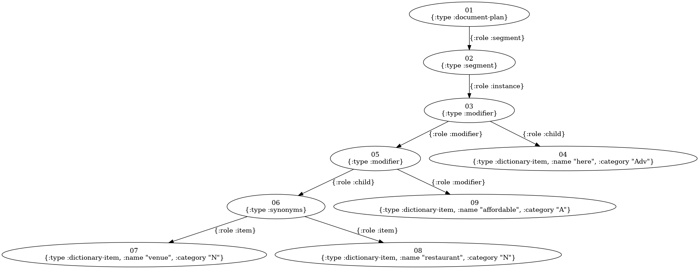

# Natural Language Generation for Accelerated Text

Library which allows to generate text using Gramatical Framework defined grammar

## Getting started

Make sure that development environment (or at least gf service) is running.

Main entrypoint for text generation can be accessed by invoking *acc-text.nlg.core/generate-text*.
To be able to generate it, three inputs must be provided: semantic graph, its context, and data.



Semantic graph is a document plan representation. It can be manually built, but a better idea
would be to convert existing document plans created with UI.

<TBD>

We can also visualize our semantic graph using GraphViz (must have it installed for this to work). 

```clojure
(def semantic-graph
  #:acc-text.nlg.semantic-graph{:relations [{:from :01 :to :02 :role :segment}
                                            {:from :02 :to :03 :role :instance}
                                            {:from :03 :to :04 :role :function}
                                            {:from :03 :to :05 :role :ARG0 :attributes {:name "agent"}}
                                            {:from :03 :to :06 :role :ARG1 :attributes {:name "co-agent"}}]
                                :concepts [{:id :01 :type :document-plan}
                                           {:id :02 :type :segment}
                                           {:id :03 :type :amr :value "author"}
                                           {:id :04 :type :dictionary-item :value "author"}
                                           {:id :05 :type :data :value "authors"}
                                           {:id :06 :type :data :value "title"}]})
                                           
(acc-text.nlg.semantic-graph.utils/vizgraph semantic-graph)
```

Context includes dictionary and AMR. Dictionary will used by dictionary-item 
concepts in semantic graph, while AMR defines AMR concept realization rules.

```clojure
(def context
  {:amr        {:author {:frames [{:syntax   [{:pos :NP :role "Agent"}
                                              {:pos :AUX :value "is"}
                                              {:pos :LEX :value "the author"}
                                              {:pos :ADP :value "of"}
                                              {:pos :NP :role "co-Agent"}]}
                                  {:syntax   [{:pos :NP :role "co-Agent"}
                                              {:pos :AUX :value "is"}
                                              {:pos :VERB}
                                              {:pos :ADP :value "by"}
                                              {:pos :NP :role "Agent"}]}]}}
   :dictionary {"author" ["written"]}})
```

Data are values provided to semantic graph data concepts.

```clojure
(def data
  {:authors "Manu Konchady"
   :title   "Building Search Applications"})
```

Finally, let's generate text for this semantic graph.
```clojure
(acc-text.nlg.core/generate-text semantic-graph context data)
=>
({:text   "Manu Konchady is the author of Building Search Applications.",
  :tokens [{:text "Manu", :idx 0}
           {:text "Konchady", :idx 5}
           {:text "is", :idx 14}
           {:text "the", :idx 17}
           {:text "author", :idx 21}
           {:text "of", :idx 28}
           {:text "Building", :idx 31}
           {:text "Search", :idx 40}
           {:text "Applications", :idx 47}
           {:text ".", :idx 59}]}
 {:text   "Building Search Applications is written by Manu Konchady.",
  :tokens [{:text "Building", :idx 0}
           {:text "Search", :idx 9}
           {:text "Applications", :idx 16}
           {:text "is", :idx 29}
           {:text "written", :idx 32}
           {:text "by", :idx 40}
           {:text "Manu", :idx 43}
           {:text "Konchady", :idx 48}
           {:text ".", :idx 56}]})
```
