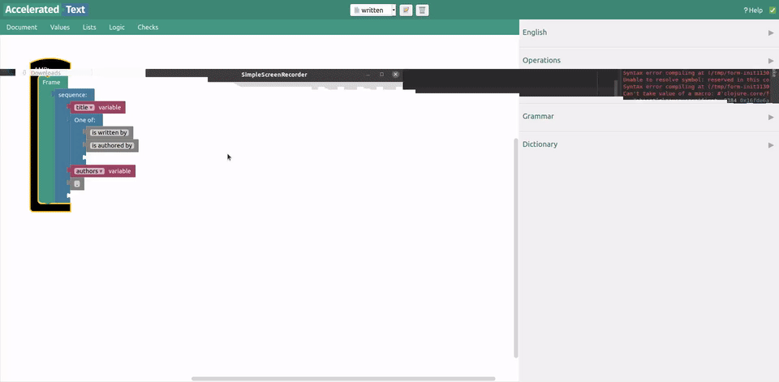

# Create a new AMR block

Accelerated Text provides an AMR editor which can be accessed at [http://localhost:8080/amr/](http://localhost:8080/amr/)

The way we create *AMR blocks* is similar to Document plan creation. 

Notice that there is no preview of generated text, since AMRs are **abstract** - most of the time we don't fully know how text will look like, since some of the *pieces* are missing. These pieces are AMR arguments, and we use *variable blocks* to define them. 

We will recreate the same sentence as in previous section.

# Add description

We can add description to AMR by using *Set variable block* with special name "*Description".

# Add another frame

One of the main differences AMRs have from Document plans is that instead of *segments*, where multiple blocks can be attached, AMRs have *frames*, and each frame is another way of how a sentence with similar meaning can be expressed.

# Use created AMR

Lets go back to the main Accelerated Text window in [http://localhost:8080](http://localhost:8080).

Newly created AMR will appear in the sidebar (if not, try refreshing the page).

