# Root blocks

These are the main blocks for document plans, AMRs and Operations. Only one of these blocks can exists in each plan, they cannot be deleted and are created automatically.

| Block | Name | Description |
| ------ | ------ | ------ |
| 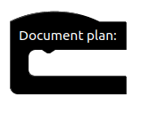 | Document plan | Root block of document plan. |
| 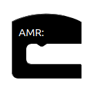                     | AMR           | Root block of AMR. |
| 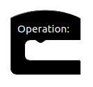         | Operation     | Root block of Operation. |

# Document blocks

Document blocks are blocks in Accelerated Text that get directly attached to root.

| Block | Name | Description |
| ------ | ------ | ------ |
| 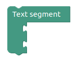           | Segment             | Text segment roughly represents a single paragraph of text and is available only in Document Plan Editor. Multiple items can be attached to this block. |
| 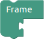               | Frame               | Frame block is a single variant of text and is only available in AMR and DLG editors. Only single item can be attached to this block. |
| 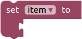 | Variable definition | Defines value of specific variable. |

# Value blocks

Basic building blocks of document plans, AMRs and Operations.

| Block | Name | Description |
| ------ | ------ | ------ |
| 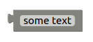                                       | Quote                    | A text that may be changed anytime. |
|                                          | Data cell                | Text from specific data row and column. Available in Data section of sidebar. |
| 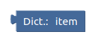                   | Dictionay item           | Word defined in dictionary. Available in Dictionary section of sidebar. |
| 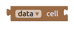                       | Data cell modifier       | Similar to data cell, with ability to attach another block. Modifies attached block. Available in Data section of sidebar. |
| 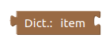 | Dictionary item modifier | Dictionary item that accepts a block to be modified. Available in Dictionary section of sidebar. |
|                                  | Modifier                 | Accepts a block to upper position that modifies a block attached to lower position. |
| 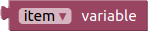                                 | Variable                 | Points to *variable definition block*. Undefined variables are treated as parameters for AMRs and Operations. |

# List blocks

| Block | Name | Description |
| ------ | ------ | ------ |
| 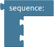               | Sequence        | Accepts multiple blocks. |
| 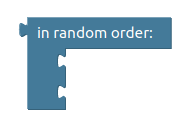 | In random order | Accepts multiple blocks that get randomly shuffled. |
| 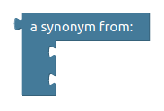  | A synonym from  | Produces variants for each attached block. Available in Document Plan Editor. |
| 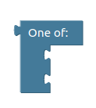                   | One of          | Works similar to *a synonym from block*. Available in AMR and DLG Editors. |

# Logic blocks

| Block | Name | Description |
| ------ | ------ | ------ |
| 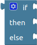               | If condition    | Conditional block. Can have multiple branches. |
| 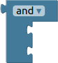             | AND             | True if both blocks are true. |
| 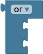               | OR              | True if one of blocks are true. |
|  | XOR (Either Or) | True if one block is true and another is false. |
|              | NOT             | True becomes false and false becomes true. |

# Checks

| Block | Name | Description |
| ------ | ------ | ------ |
|                | Equality check     | May be changed to test inequality (≠). |
|  | Greater than check | Works with numbers. May be changed to test greater than or equal (>=), less than (<), less than or equal (<=) |
|                | Is in check        | Checks if substring is included string. |
