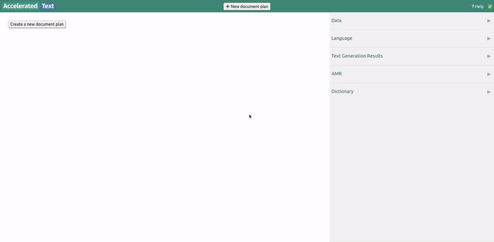
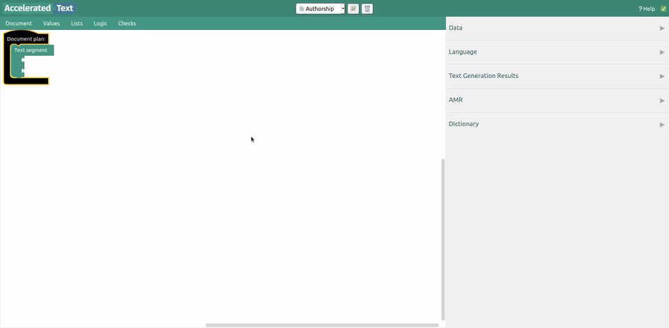
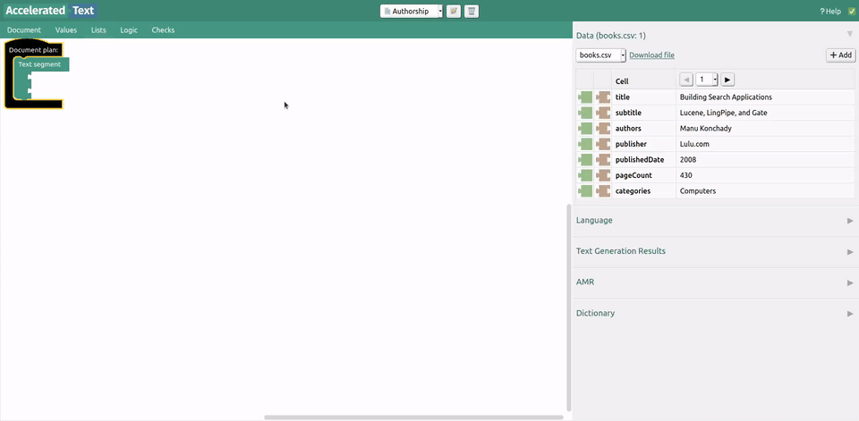
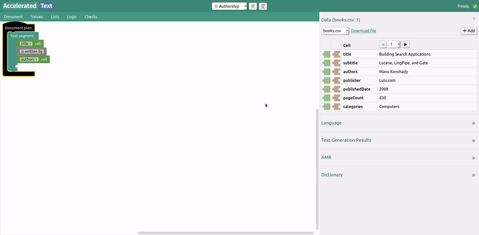
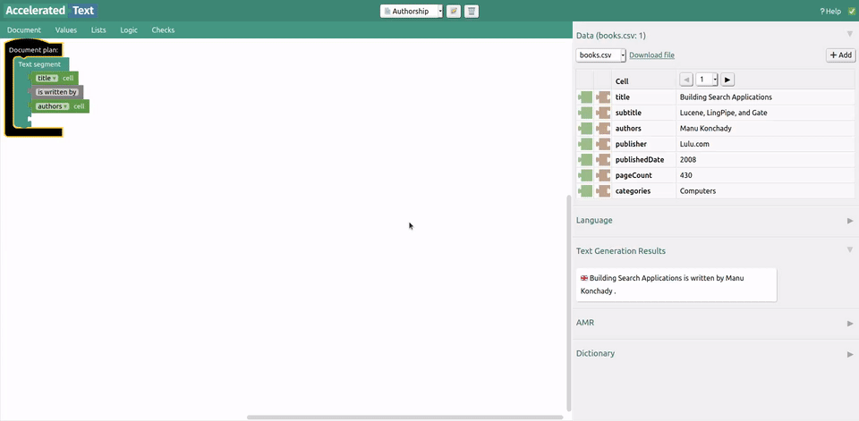
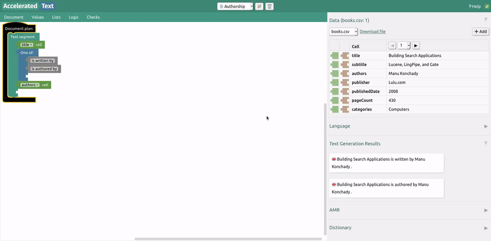

# Create a new document plan

Once Accelerated Text environment is running, you should be able to access *Document Plan Editor* at [http://localhost:8080](http://localhost:8080).

To create a new document plan, press "New document plan", then type the name of the document plan and hit OK.

# Upload a data file

Accelerated text works with spreadsheet data where first row is reserved for column names, for example:

author|title
---|---
Shakespeare|Macbeth
Dante|Inferno

# Attach text blocks

There are many types of blocks in Accelerated Text, but the most basic ones are *quote* blocks (grey) and *data* blocks (green).

# See results

Text is generated on each change to document plan. You can view results in the sidebar.

# Add variations

Sometimes different words can express the same message. *One of synonyms* block can be used for this purpose.

# Change data rows

Text is generated for one row at a time. We can change current row in *Data* section of sidebar.

