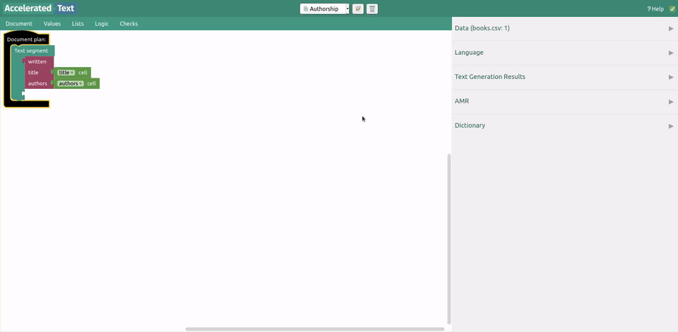
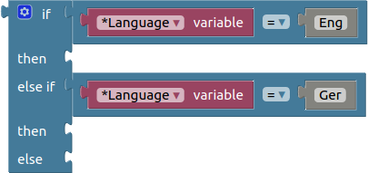

# Configuration

Refer to *docker-compose.yml* at the project root.

To change languages displayed in Accelerated Text UI, change the `ENABLED_LANGUAGES` environment variable.

Supported languages are:

* English
* Estonian
* German
* Latvian
* Russian
* Spanish

We will illustrate multi language text generation by additionally enabling German language. Environment variable in *docker-compose.yml* should look like this:

```
      ENABLED_LANGUAGES: "english,german"

```

# Select language

When dictionary items are defined for both languages, most of the time we will not need to do anything else.



However, if we wanted to generate text using more template-like style, for this purpose we would use *if block* with special variable **Language*:



Additionally, there are language specific helper operations in AMR Editor's sidebar.
