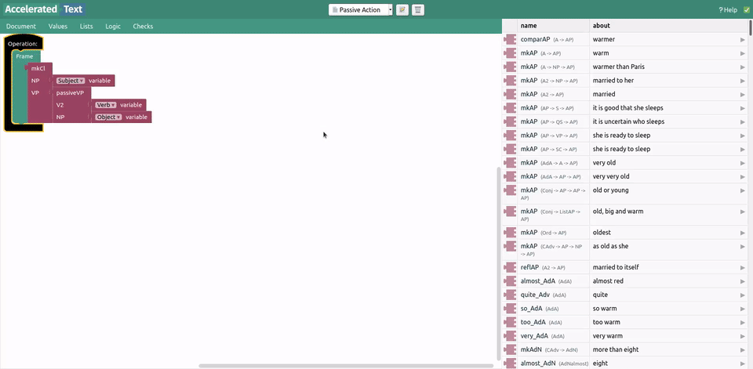
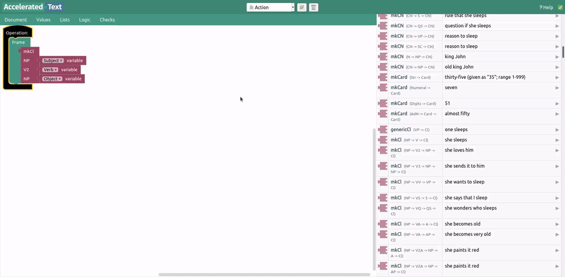
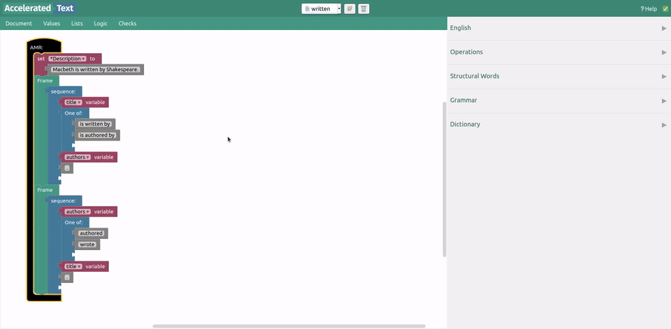
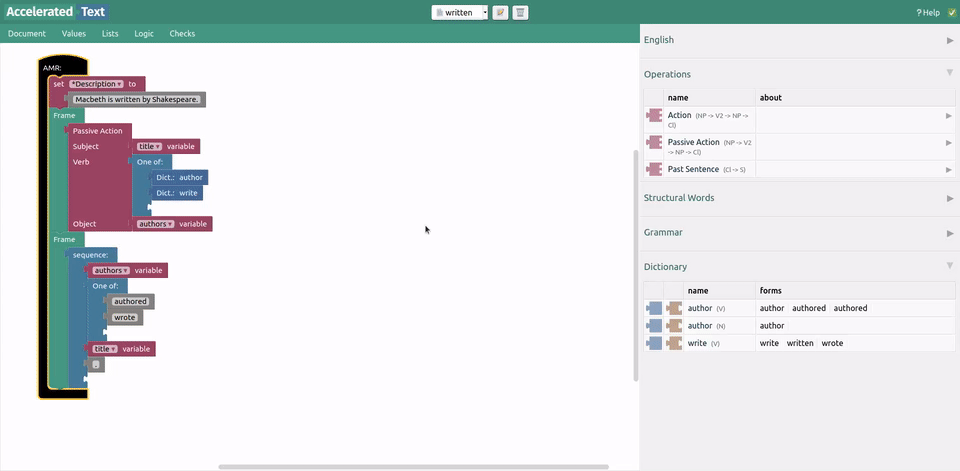
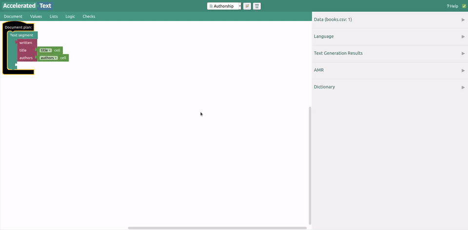

# On operations

To create operations, we must first access DLG Editor at [http://localhost:8080/dlg/](http://localhost:8080/dlg/). Operations are constructed using blocks from Grammatical Framework's [Resource Grammar Library](https://www.grammaticalframework.org/lib/doc/synopsis/index.html). Once created, we will be able to use them from AMR Editor. 

This part can be a bit tricky though, especially when starting out - constructing operations requires a bit of hard work and linguistic knowledge, but it is worth it in the end, since operation blocks are truly dynamic (we will see that soon enough). 

# Creating operations

We will be replacing template-like quote blocks that we previously defined when creating an AMR.

# Higher-level operations

We can also define operations, that take other operation blocks as arguments.

# Using operations

Let's come back to AMR Editor and use operations that we have just created. We will also be using dictionary item blocks from the dictionary that we constructed previously.

# Testing text generation

If we do not alter AMR or operation parameters in any way (like this time), we only need to refresh text generation to see if changes to AMRs or operations take effect.

