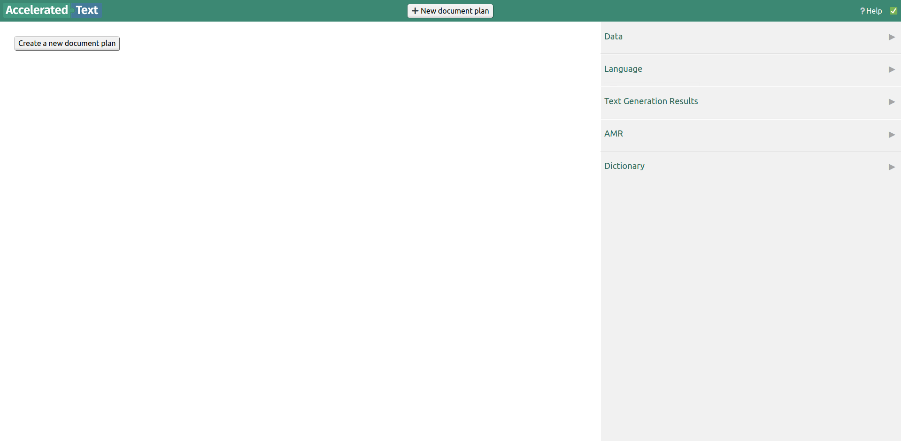
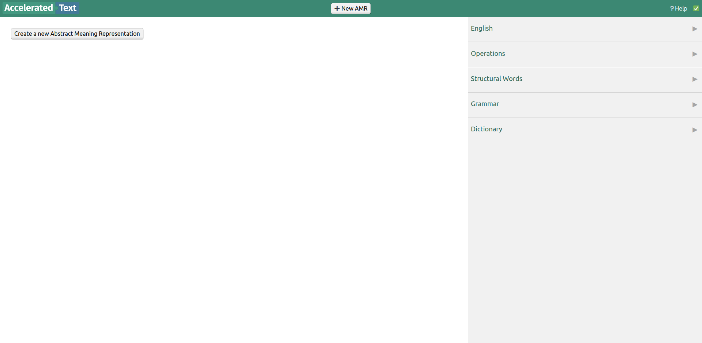
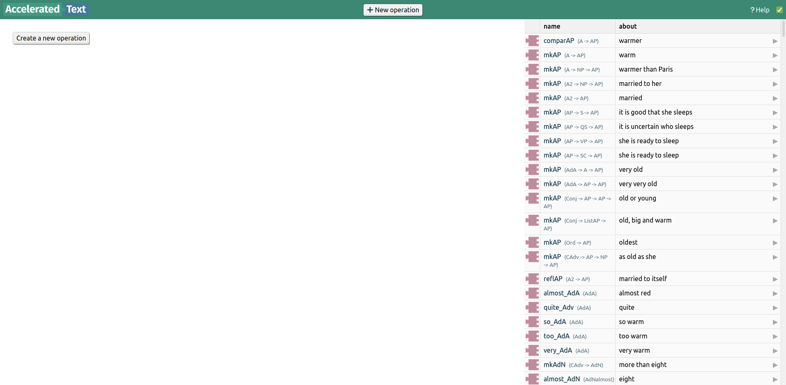

Accelerated Text is a visual programming platform. At the highest level, it uses [Google Blockly](https://developers.google.com/blockly/) environment that lets users build text somewhat similar to assembling a jigsaw puzzle. When the main structure, called document plan, is built, it then goes through a series of steps, getting transformed into [Grammatical Framework](https://www.grammaticalframework.org/) code before finally coming back as text.

There are three levels of planning, each having its own environment and purpose:

* **Document Plan Editor** is the top-level editor used to build text on a paragraph level
* **AMR Editor** is the mid-level editor that mostly deals with sentence building
* **DLG Editor** is the lowest level editor where simple clauses are built

Each of the editors are described below.

# Document Plan Editor

Document Plan Editor is the main editor where users will spend most of their time building paragraphs of text. Only in this environment there is:
 
* a preview of generated text,
* ability to upload data files and use cells as text building blocks,
* select in what languages text will be generated,
* use AMRs, created in AMR Editor.

# AMR Editor

Abstract Meaning Representations, or AMRs, are blocks in Accelerated Text that usually capture rough meaning of a sentence. They are inspired by Banarescu, Bonial et al. paper "[Abstract Meaning Representation for Sembanking](https://amr.isi.edu/a.pdf)". You can find more information on AMRs in their [guidelines](https://github.com/amrisi/amr-guidelines/blob/master/amr.md).

AMRs are also the most dynamic building blocks - not only the text that they produce depends on the context that they are in, but they may even produce the same message in different languages. There is no magic though - AMRs must be fully built in AMR Editor, and when we later use them in Document Plan Editor, all the complexity is hidden away.

AMR Editor has access to language specific blocks and operations built in DLG Editor.

# DLG Editor

What is special about DLG Editor, is that the sidebar is filled with special blocks from [Grammatical Framework's Resource Grammar Library](https://www.grammaticalframework.org/lib/doc/synopsis/index.html). And sooner or later, blocks from all levels of editing get transformed into GF's operations.

