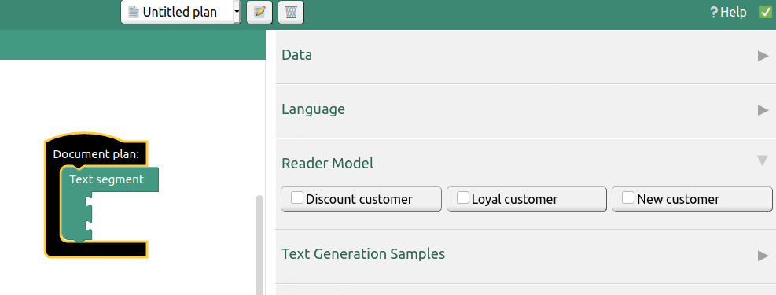
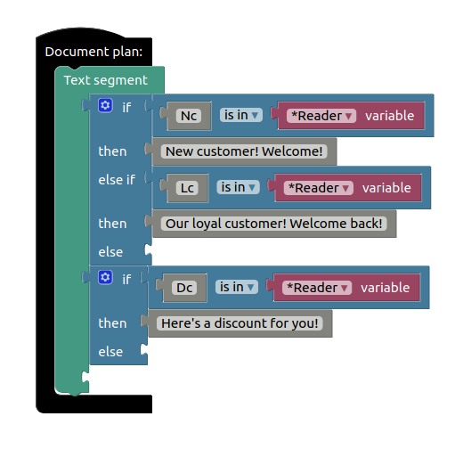
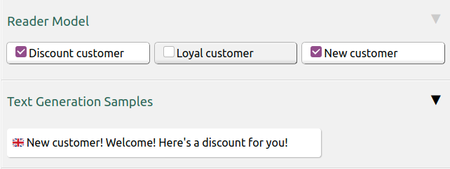
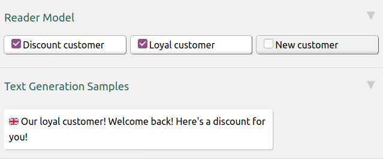

# About

Reader models help personalize text based on predefined user groups. Using this feature, we can generate partially or completely different texts for users that belong to different groups.

# Configuration

After deciding what groups are relevant to your domain, you need to add them to reader model configuration file, which is located in `api/resources/config/readers.edn`.

Lets define configuration for `New customer`, `Discount customer` and `Loyal customer`:
```clojure
[#:data.spec.reader-model{:code "Nc" :name "New customer" :available? true}
 #:data.spec.reader-model{:code "Dc" :name "Discount customer" :available? true}
 #:data.spec.reader-model{:code "Lc" :name "Loyal customer" :available? true}]
```

# Usage

When configuration is complete, defined reader models should appear in Accelerated Text sidebar:



Next, we will construct a Document plan with reader-specific branches using if-condition blocks and a special `*Reader` variable. Here it is:



Notice the usage of "**is in**" check instead of "**=**". This way, a reader can be regarded both as a "New customer" and a "Discount customer" at the same time!

Here are the text examples with different reader configurations, produced using Document plan pictured above.




