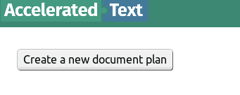
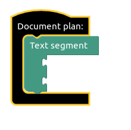
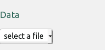
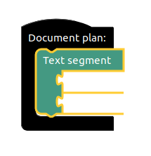
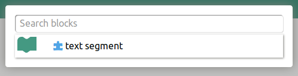
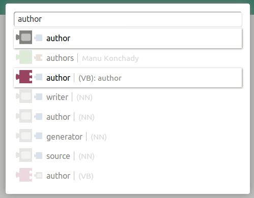
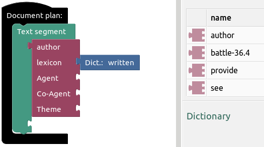
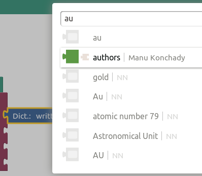
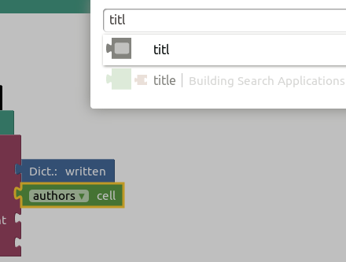
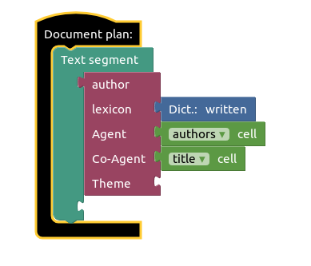

# Text Generation Guide

We assume that Accelerated Text environment is already running and can be reached at http://localhost:8080.

If not, please set up the [environment](environment.md) first.

## Create Document Plan

Follow the step by step guide bellow to create a very simple document plan which generates book authorship sentences.

| View | Step |
| ------ | ------ |
|  | Press _Create a new document plan_ in the upper left corner of the screen. |
|  | Make sure that an empty document plan similar to the one pictured on the left has appeared in the workspace. |
|  | Select bundled sample _books.csv_ file in Data section on the right. |
|  | Select _Text Segment_ block by pressing left mouse button on it. |
|  | Open block search menu by pressing "CTRL + ,". |
|  | Type "author" and select pink _Abstract Meaning Representation_ block. |
|  | Press on newly appeared "author" block and open search menu again ("CTRL + ,"). |
|  | Select green "authors" data block which is our _Agent_ in this case. |
|  | Repeat the same process to select "title" data block which will represent _Co-Agent_. |
|  | The plan is ready by now and should look like the picture on the left. |
|  | Navigate to _Text Analysis_ section to see text variations generated by the natural language generation engine. |
